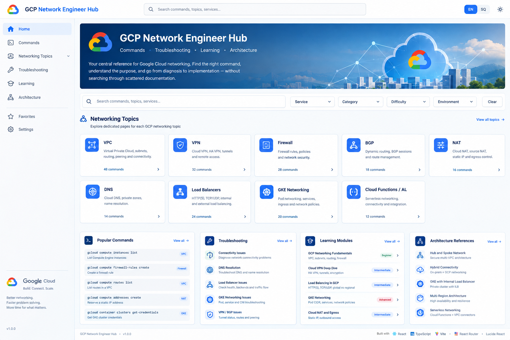

<div align="center">

# ☁️ GCP Network Engineer Hub

### **Google Cloud Networking Reference & Engineering Portal**

A modern, responsive knowledge platform for **Google Cloud networking engineers**, combining command references, troubleshooting workflows, learning resources, and architecture patterns in one centralized engineering hub.

<br>



<br>

[](https://react.dev/)
[](https://www.typescriptlang.org/)
[](https://vite.dev/)
[](https://reactrouter.com/)
[](https://lucide.dev/)

<br>


</div>

---

## 🚀 Overview

**GCP Network Engineer Hub** is a centralized reference and knowledge platform designed for engineers working with **Google Cloud networking**.

The application brings frequently used commands, troubleshooting procedures, learning resources, and architecture references together in a single engineering-focused interface.

Instead of searching through scattered documentation, engineers can quickly:

> **Search → Understand → Diagnose → Configure → Validate**

The project is designed with scalability and maintainability in mind, allowing the command catalog and knowledge base to grow to hundreds of entries without requiring major architectural changes.

---

## ✨ Key Capabilities

<table>
<tr>
<td width="50%">

### 💻 Command Catalog

A structured database of Google Cloud networking commands organized by:

* Service
* Category
* Difficulty
* Environment
* Networking topic

</td>
<td width="50%">

### 🔎 Search & Filtering

Quickly locate relevant commands and resources using filters for:

* Services
* Categories
* Difficulty
* Environment
* Networking domains

</td>
</tr>

<tr>
<td width="50%">

### 🛠️ Troubleshooting

Operational runbooks covering common networking problems, including:

* Connectivity
* DNS
* VPN
* BGP
* Firewall
* NAT
* GKE

</td>
<td width="50%">

### 🎓 Learning

Structured learning modules covering Google Cloud networking fundamentals through advanced architecture concepts.

</td>
</tr>

<tr>
<td width="50%">

### 🏗️ Architecture

Reference patterns for designing scalable Google Cloud networking environments.

</td>
<td width="50%">

### 🌍 Bilingual UI

Built-in support for:

**🇬🇧 English**
**🇦🇱 Albanian**

</td>
</tr>
</table>

---

# 🌐 Networking Domains

The platform provides dedicated reference areas for major Google Cloud networking technologies.

<div align="center">

|         Domain        | Coverage                                   |
| :-------------------: | ------------------------------------------ |
|       🔵 **VPC**      | Networks, subnets, routes, firewall rules  |
|       🔐 **VPN**      | HA VPN, tunnels, routing, connectivity     |
|    🛡️ **Firewall**   | Firewall rules, policies, security         |
|       🔄 **BGP**      | Cloud Router, sessions, dynamic routing    |
|       🌐 **NAT**      | Cloud NAT, egress, source NAT              |
|       🔎 **DNS**      | Cloud DNS, private zones, resolution       |
| ⚖️ **Load Balancing** | HTTP(S), TCP/UDP, internal/external        |
| ☸️ **GKE Networking** | Pods, services, ingress, network policies  |
|   ☁️ **Serverless**   | VPC connectivity and serverless networking |

</div>

---

# 💻 Command Database

The command catalog is maintained as structured data instead of being embedded directly into the UI.

```text
src/
└── data/
    └── commands.ts
```

This separation between **content and presentation** provides a scalable foundation for the application.

### Benefits

* Easy command maintenance
* Centralized networking knowledge
* Searchable command metadata
* Service-based categorization
* Difficulty classification
* Environment tagging
* Easier future versioning
* Scalable to hundreds of commands

Example conceptual structure:

```text
Command
├── Service
├── Category
├── Difficulty
├── Environment
├── Description
├── Command
└── Documentation
```

---

# 🧭 Topic-Based Navigation

Each networking domain has its own dedicated navigation and reference area.

This avoids forcing engineers to navigate through a single large command list and makes the platform better suited for operational use.

```text
                    GCP Network Engineer Hub
                              │
        ┌─────────────────────┼─────────────────────┐
        │                     │                     │
        ▼                     ▼                     ▼
      Commands          Troubleshooting          Learning
        │                     │                     │
        └─────────────────────┼─────────────────────┘
                              │
                              ▼
                       Architecture
```

---

# 🛠️ Troubleshooting & Runbooks

The platform includes operational references intended to support real-world troubleshooting workflows.

### Example workflow

```text
┌───────────────────────┐
│ Connectivity Problem  │
└───────────┬───────────┘
            │
            ▼
┌───────────────────────┐
│ Check Routes          │
└───────────┬───────────┘
            │
            ▼
┌───────────────────────┐
│ Check Firewall Rules  │
└───────────┬───────────┘
            │
            ▼
┌───────────────────────┐
│ Check DNS / NAT       │
└───────────┬───────────┘
            │
            ▼
┌───────────────────────┐
│ Check VPN / BGP       │
└───────────┬───────────┘
            │
            ▼
┌───────────────────────┐
│ Validate Service      │
└───────────┬───────────┘
            │
            ▼
┌───────────────────────┐
│ Apply Resolution      │
└───────────────────────┘
```

Operational references include:

* Network connectivity troubleshooting
* DNS resolution diagnostics
* VPN tunnel troubleshooting
* BGP session troubleshooting
* Firewall rule analysis
* Cloud NAT and egress troubleshooting
* Load balancer diagnostics
* GKE networking issues

---

# 🎓 Learning Modules

The learning section provides structured material for engineers developing their Google Cloud networking skills.

### 🟢 Fundamentals

* GCP networking fundamentals
* VPC concepts
* Subnets
* Routing
* Firewall fundamentals

### 🟡 Intermediate

* Cloud VPN
* Cloud NAT
* Cloud DNS
* Load Balancing
* Dynamic routing
* BGP

### 🔴 Advanced

* GKE networking
* Hybrid connectivity
* Shared VPC
* Multi-VPC architecture
* Advanced network security
* High-availability networking

---

# 🏗️ Architecture References

The architecture section provides reusable reference patterns for common Google Cloud environments.

### Reference architectures

* Hub-and-spoke networking
* Shared VPC
* Hybrid cloud connectivity
* Multi-VPC environments
* GKE networking
* Internal load balancing
* High-availability architectures
* Serverless networking

The architecture layer is designed to complement the command and troubleshooting sections by connecting **individual commands and operational tasks with larger infrastructure designs**.

---

# 🌍 Bilingual Experience

The application supports both **English 🇬🇧** and **Albanian 🇦🇱**.

A language switch is available directly within the application interface.

The architecture also allows additional translations to be introduced in the future without restructuring the application.

---

# 🧩 Technology Stack

<div align="center">

| Technology          | Purpose                                   |
| :------------------ | :---------------------------------------- |
| ⚛️ **React 19**     | User interface and component architecture |
| 🔷 **TypeScript**   | Type-safe application development         |
| ⚡ **Vite**          | Development server and build tooling      |
| 🧭 **React Router** | Client-side routing                       |
| ✨ **Lucide React**  | UI icons and visual components            |

</div>

---

# 📁 Project Structure

```text
gcp-network-engineer-hub/
│
├── src/
│   ├── App.tsx
│   ├── App.css
│   ├── main.tsx
│   │
│   └── data/
│       ├── architecture.ts
│       ├── commands.ts
│       ├── learning.ts
│       └── troubleshooting.ts
│
├── public/
│
├── index.html
├── package.json
├── tsconfig.json
├── vite.config.ts
├── .gitignore
└── README.md
```

---

# ⚙️ Getting Started

## 1. Clone the Repository

```bash
git clone <repository-url>
cd gcp-network-engineer-hub
```

## 2. Install Dependencies

```bash
npm install
```

## 3. Start the Development Server

```bash
npm run dev -- --host 0.0.0.0 --port 4173
```

The application will be available at:

```text
http://localhost:4173
```

---

# 📦 Production Build

Create an optimized production build:

```bash
npm run build
```

The generated production files will be placed in:

```text
dist/
```

---

# 🔍 Preview Production Build

To locally preview the production build:

```bash
npm run preview -- --host 0.0.0.0 --port 4173
```

---

# 📈 Scalability & Maintainability

The application follows a modular, data-driven architecture designed for long-term growth.

The separation of networking data from UI components makes it possible to expand the platform without restructuring the core application.

### Designed for future expansion

* 📚 Hundreds of networking commands
* 🔎 Advanced search ranking
* 🏷️ Tag-based relevance
* ⭐ Command favorites
* 📌 Saved command snippets
* 🕘 Recently viewed commands
* 🗂️ Content versioning
* 👥 Internal documentation management
* 🔐 Administrative features
* 🌍 Additional language support
* 📊 More advanced networking analytics

---

# 🔮 Future Roadmap

| Feature                      | Description                                                     |
| :--------------------------- | :-------------------------------------------------------------- |
| 🔎 **Advanced Search**       | Improve search relevance and ranking                            |
| 🏷️ **Tagging System**       | Introduce more granular command categorization                  |
| ⭐ **Favorites**              | Allow engineers to save frequently used commands                |
| 📌 **Snippets**              | Save and organize custom command snippets                       |
| 🛠️ **Admin Layer**          | Manage commands and documentation through an internal interface |
| 🌍 **Localization**          | Expand Albanian translations and add additional languages       |
| 🏗️ **Architecture Library** | Add more detailed architecture diagrams                         |
| 📖 **Documentation**         | Expand operational runbooks and learning paths                  |

---

# 🎯 Project Vision

The goal of **GCP Network Engineer Hub** is to create a practical, centralized knowledge platform for Google Cloud networking professionals.

The platform brings together four core engineering resources:

<div align="center">

### 💻 Commands

**Know what to run**

⬇️

### 🛠️ Troubleshooting

**Know how to diagnose**

⬇️

### 🎓 Learning

**Understand why it works**

⬇️

### 🏗️ Architecture

**Understand how it fits together**

</div>

---

# 📌 Project Information

| Property           | Details                              |
| :----------------- | :----------------------------------- |
| **Project Name**   | GCP Network Engineer Hub             |
| **Repository**     | `gcp-tutorial-2027`                  |
| **Category**       | Cloud Networking / Engineering Tools |
| **Platform**       | Web Application                      |
| **Frontend**       | React 19 + TypeScript                |
| **Build Tool**     | Vite                                 |
| **Cloud Platform** | Google Cloud                         |
| **Languages**      | English / Albanian                   |
| **Purpose**        | Networking Reference & Knowledge Hub |

---

# ☁️ Google Cloud Networking

The project focuses on practical Google Cloud networking knowledge and provides a foundation for engineers working with cloud infrastructure, networking operations, troubleshooting, and architecture.

---

<div align="center">

## ☁️ GCP Network Engineer Hub

### **Cloud Networking • Commands • Troubleshooting • Learning • Architecture**

<br>


<br><br>

**gcp-tutorial-2027**

© **Artan.V**

</div>
